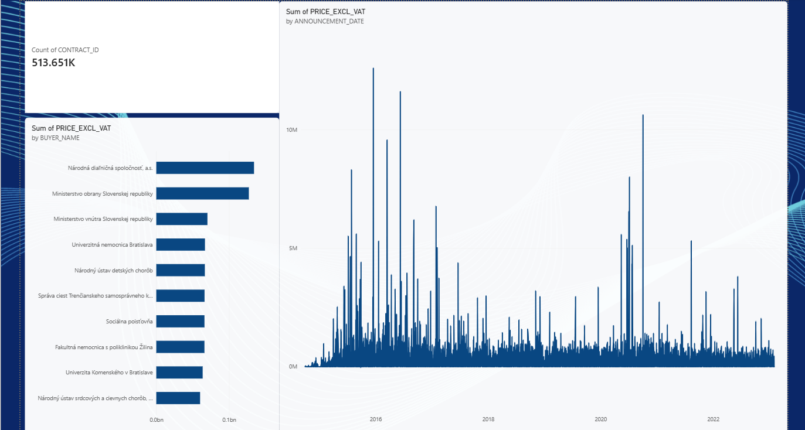

# ETL Pipeline — Data Engineering Rebuild

A straightforward extract → transform → load pipeline in Python, writing into MySQL via SQLAlchemy.

## Setup in VS Code

1. Open this folder in VS Code.
2. Create a virtual environment:
   ```
   python -m venv venv
   venv\Scripts\activate        # Windows
   source venv/bin/activate     # Mac/Linux
   ```
3. Install dependencies:
   ```
   pip install -r requirements.txt
   ```
4. Copy `.env.example` to `.env` and fill in your real MySQL credentials.
5. Put your dataset file in `data/raw/` and update `SOURCE_FILE_PATH` in `.env` to match its filename.
6. Make sure the target MySQL database (`DB_NAME` in `.env`) already exists — create it with:
   ```sql
   CREATE DATABASE etl_project;
   ```

## Run it

```
python main.py
```

This runs extract → transform → load in sequence and logs progress at each stage.

## Structure

```
extract/    - reads the raw file into a DataFrame
transform/  - basic cleaning: dedup, whitespace, dropped nulls (edit for your actual columns)
load/       - writes the cleaned data into MySQL, chunked for large datasets
config/     - loads DB credentials and paths from .env
main.py     - runs the full pipeline
```

## Next steps (once your real dataset is in)

Open `transform/transform.py` and replace the `TODO` section with rules specific to your columns
(type coercion, required-field checks, value-range validation, etc.).

## Dashboard



Live Power BI dashboard connected directly to the Snowflake `TRANSACTIONS` table — 514K+ Slovak public procurement records, showing total contract count, top buyers by spend, and contract value trends over time.